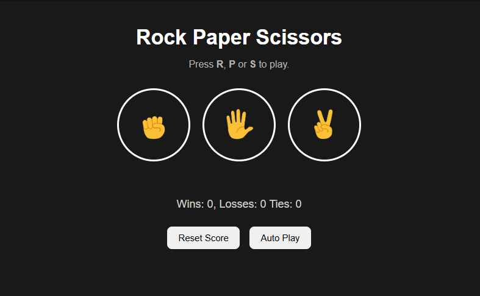

<h1 align="center">
🪨 Rock Paper Scissors
</h1>

<p align="center">
A classic <strong>Rock Paper Scissors</strong> game built using <strong>HTML5</strong>, <strong>CSS3</strong>, and <strong>JavaScript</strong>.
</p>

<p align="center">


</p>

<p align="center">

<a href="https://rushikesh-rane.github.io/rock-paper-scissors/">

</a>

<a href="https://github.com/rushikesh-rane/rock-paper-scissors">

</a>

</p>

---

# 📖 Overview

Rock Paper Scissors is an interactive browser game created while learning JavaScript fundamentals.

The project focuses on DOM manipulation, event handling, local storage, keyboard events, and writing clean, interactive JavaScript while keeping the user interface simple and responsive.

---

# 🖼️ Preview


<p align="center">



</p>

---

# ✨ Features

- 🪨 Play Rock, Paper, or Scissors against the computer
- 🤖 Auto Play mode
- ⏹️ Auto Play / Stop Auto Play toggle
- 💾 Score saved using Local Storage
- ⌨️ Keyboard shortcuts (R, P, S)
- 📊 Live score tracking
- 🎨 Clean modern interface
- ✨ Smooth hover animations

---

# 🛠️ Tech Stack

| Technology | Purpose |
|------------|----------|
| HTML5 | Structure |
| CSS3 | Styling |
| JavaScript (ES6) | Game Logic |
| Local Storage | Save Score |
| DOM API | User Interaction |

---

# 📂 Project Structure

```text
rock-paper-scissors/
│
├── img/
│   ├── preview.png
│   ├── rock-emoji.png
│   ├── paper-emoji.png
│   └── scissors-emoji.png
│
├── index.html
└── README.md
```

---

# 🎯 What I Learned

During this project I learned how to:

- Manipulate the DOM using JavaScript
- Handle click and keyboard events
- Store data using Local Storage
- Generate random computer moves
- Build reusable JavaScript functions
- Use `setInterval()` and `clearInterval()`
- Create interactive web applications
- Improve UI using CSS transitions

---

# 🚀 Future Improvements

- [ ] Sound effects
- [ ] Better game statistics
- [ ] Win/Loss animations
- [ ] Theme switcher
- [ ] Difficulty modes
- [ ] Multiplayer support

---

# 🌍 Live Demo

👉 **https://rushikesh-rane.github.io/rock-paper-scissors/**

---

# 👨‍💻 Author

**Rushikesh Rane**

📍 Mumbai, India

GitHub:
https://github.com/rushikesh-rane

LinkedIn:
https://linkedin.com/in/rushikesh-rane-dev

---

<p align="center">

Made with ❤️ by Rushikesh Rane

</p>